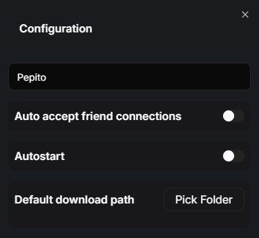

# Configurations

The client app has a few interesting configurations you can make to improve your experience.

### Display Name

The Display Name is the "name" of your Client. It is initially taken from your Google Account's name, but can be changed by editing the text box.

### Auto-accept friend connections

This setting allows any friended Discord accounts to connect to the Client without it accepting the connection first. Only use this with Discord accounts your trust.

### Auto-start

Toggles the Client app running on startup or not.

### Default download path

Sets the path where all downloads from the Client App will go to. By default, it's set to `%USERPROFILE%\Downloads\`.
