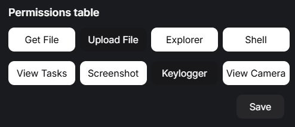

# User Permissons

The RemoteCord Client app allows you to set different permissions to each user that you friend.

To visualize this, we can imagine 2 users: _User1_ & _User2_. With user permissions, _User1_ can have full access while _User2_ can only view tasks.

:::warning Warning
By default, all users you friend have **full access permissions**. Make sure to set proper permissions for untrusted users before allowing them to access your machine.
:::

### Get File

Toggles whether the user can download files from the Client using `/get`.

### Upload File

Toggles whether the user can upload files to the Client using `/upload`.

### Explorer

Toggles whether the user can use the `/explorer` command.

### Shell

Toggles whether the user can execute shell commands using `/cmd`

### View Tasks

Toggles whether the user can view running processes in the Client using the `/tasks` command.

### Screenshot

Toggles whether the user can take screenshots of the Client using the `/screenshot` command.

### Keylogger

Toggles wherther the user has access to the `/keylogger` command.

### View Camera

Toggles whether the user can see screenshots of the Client's cameras using the `/camera` command.
